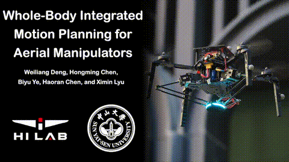
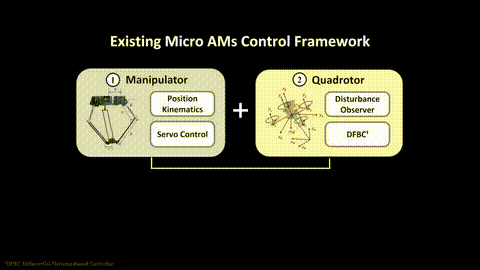
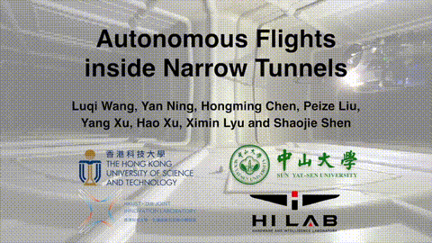
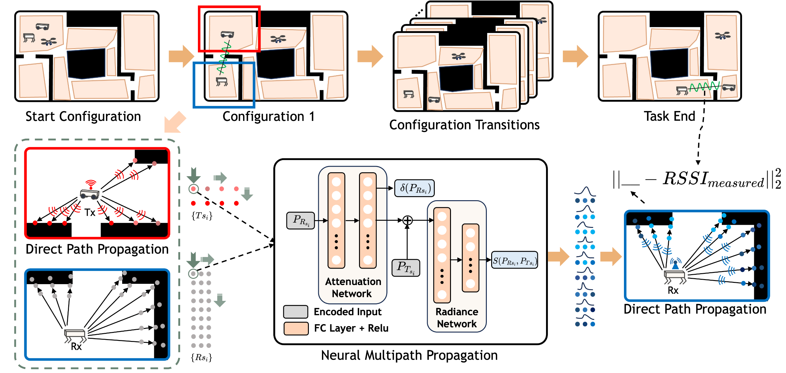

<html>
    * means equal contribution
    <table style="width:100%;border:0px;border-spacing:0px;border-collapse:separate;margin-right:auto;margin-left:auto;">
          <tr onmouseout="nightsight_stop()" onmouseover="nightsight_start()">
            <td style="padding:20px;width:25%;vertical-align:middle;border-left-style:none;border-bottom-style:none;border-top-style:none;border-right-style:none">
              
            </td>
            <td style="padding:20px;width:75%;vertical-align:middle;border-left-style:none;border-bottom-style:none;border-top-style:none;border-right-style:none">
                <papertitle>IRS: Instance-Level 3D Scene Graphs via Room Prior Guided LiDAR-Camera Fusion
                </papertitle>
               
               <strong>Hongming Chen*</strong>, Yiyang Lin*, Ziliang Li, Biyu Ye, Yuying Zhang, Yongyang Xiong, Ximin Lyu
               
              <em>IEEE Robotics and Automation Letters underview</em> 
              
              
              
            </td>
          </tr>
    </table>
    <table style="width:100%;border:0px;border-spacing:0px;border-collapse:separate;margin-right:auto;margin-left:auto;">
          <tr onmouseout="nightsight_stop()" onmouseover="nightsight_start()">
            <td style="padding:20px;width:25%;vertical-align:middle;border-left-style:none;border-bottom-style:none;border-top-style:none;border-right-style:none">
              
            </td>
            <td style="padding:20px;width:75%;vertical-align:middle;border-left-style:none;border-bottom-style:none;border-top-style:none;border-right-style:none">
                <papertitle>Whole-Body Integrated Motion Planning for Aerial Manipulators
                </papertitle>
               
              Weiliang Deng*, <strong>Hongming Chen*</strong>, Biyu Ye, Haoran Chen, Ximin Lyu
               
               * means equal contribution 
              <em>IEEE Transactions on Robotics (T-RO) underview</em> 
              
              
              
            </td>
          </tr>
    </table>
    <table style="width:100%;border:0px;border-spacing:0px;border-collapse:separate;margin-right:auto;margin-left:auto;">
          <tr onmouseout="nightsight_stop()" onmouseover="nightsight_start()">
            <td style="padding:20px;width:25%;vertical-align:middle;border-left-style:none;border-bottom-style:none;border-top-style:none;border-right-style:none">
              
            </td>
            <td style="padding:20px;width:75%;vertical-align:middle;border-left-style:none;border-bottom-style:none;border-top-style:none;border-right-style:none">
                <papertitle>NDOB-based control of a UAV with Delta arm considering manipulator dynamics
                </papertitle>
               
                <strong>Hongming Chen</strong>, Biyu Ye, Xianqi Liang, Weiliang Deng, Ximin Lyu
               
              <em>IEEE International Conference on Robotics and Automation (ICRA), 2025.</em> 
              
              
              
            </td>
          </tr>
    </table>
    <table style="width:100%;border:0px;border-spacing:0px;border-collapse:separate;margin-right:auto;margin-left:auto;">
          <tr onmouseout="nightsight_stop()" onmouseover="nightsight_start()">
            <td style="padding:20px;width:25%;vertical-align:middle;border-left-style:none;border-bottom-style:none;border-top-style:none;border-right-style:none">
              
            </td>
            <td style="padding:20px;width:75%;vertical-align:middle;border-left-style:none;border-bottom-style:none;border-top-style:none;border-right-style:none">
                <papertitle>Autonomous Flights inside Narrow Tunnels
                </papertitle>
               
                 Luqi Wang, Yan Ning, <strong>Hongming Chen</strong>, Peize Liu, Yang Xu, Hao Xu, Ximin Lyu, Shaojie Shen
               
              <em> IEEE Transactions on Robotics (T-RO) </em> 
              
              
              
            </td>
          </tr>
    </table>
    <table style="width:100%;border:0px;border-spacing:0px;border-collapse:separate;margin-right:auto;margin-left:auto;">
          <tr onmouseout="nightsight_stop()" onmouseover="nightsight_start()">
            <td style="padding:20px;width:25%;vertical-align:middle;border-left-style:none;border-bottom-style:none;border-top-style:none;border-right-style:none">
              
            </td>
            <td style="padding:20px;width:75%;vertical-align:middle;border-left-style:none;border-bottom-style:none;border-top-style:none;border-right-style:none">
                <papertitle>FERMI: Flexible Radio Mapping with a Hybrid Propagation Model and Scalable Autonomous Data Collection
                </papertitle>
               
              Yiming Luo, Yunfei Wang, <strong>Hongming Chen</strong>, Chengkai Wu, Ximin Lyu, JINNI ZHOU, Jun Ma, Fu Zhang, Boyu Zhou
              <em>Robotics: Science and Systems 2025</em> 
              
            </td>
          </tr>
    </table>

</html>

